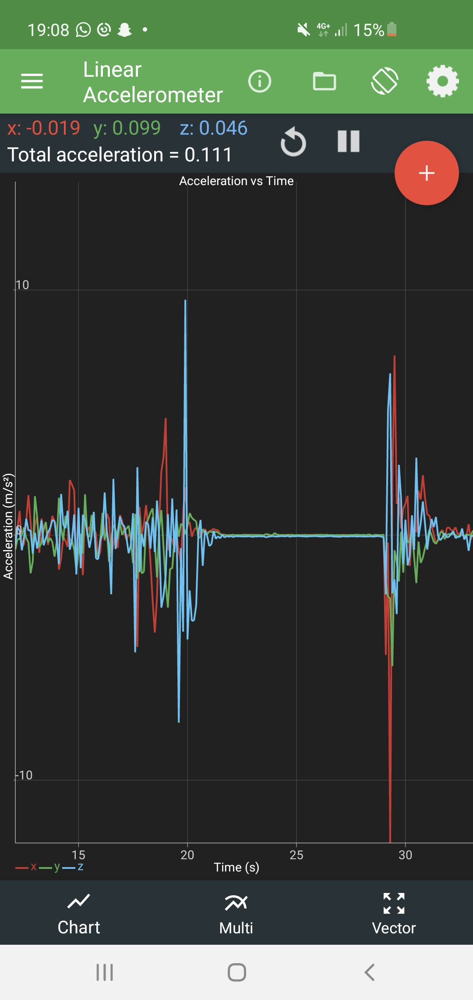
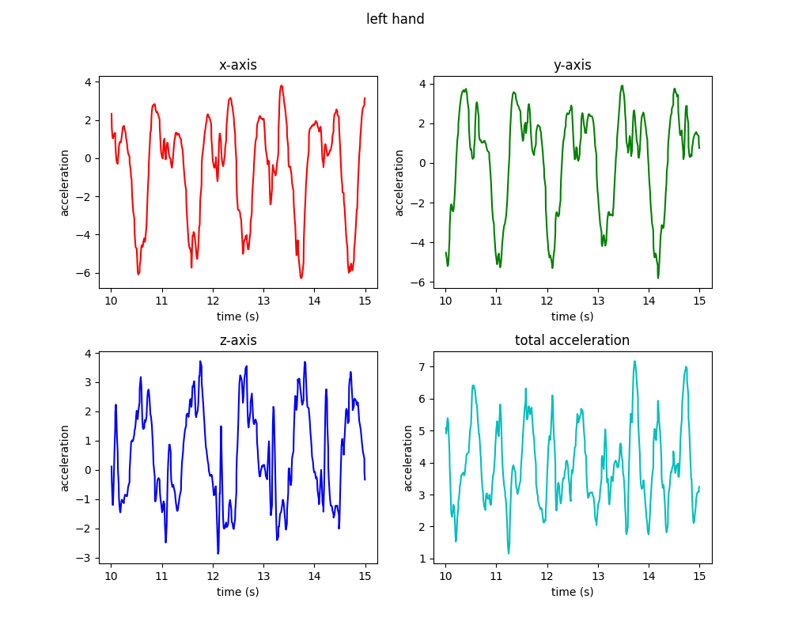
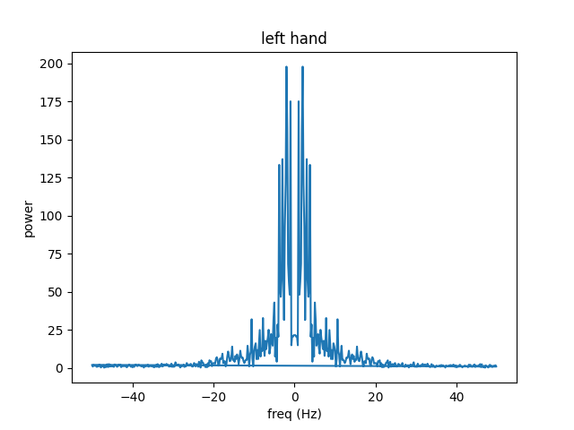
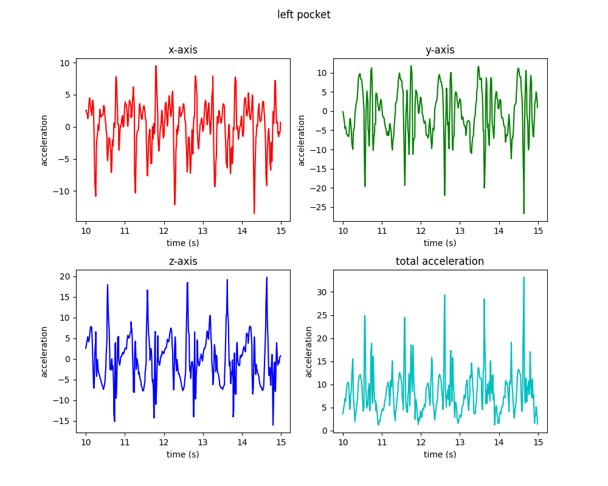
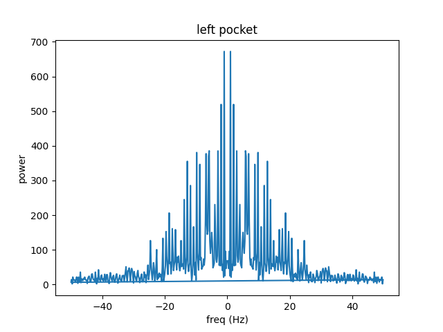

# Exercise PC Design & Development / Systems and Environments

## Assignment 2

**11908757 Stefan Haslhofer**

##### 1. Remarks

The data was acquired by walking the same street up and down to have similar recording conditions.

Python code: https://github.com/StefanHaslhofer/PervasiveComputing/tree/main/Assignment2

##### 2. Data recording

I recorded the acceleration over time on my mobile phone with an app called _Physics Toolbox Sensor Suite_.
The app allows access to the phone's built-in linear accelerometer and displays acceleration on x, y and z axis as well
as a total acceleration value.

The data can be exported as _csv_. Each row contains a timestamp and all axis values plus the total acceleration.

##### 3. Pre-processing and Segmentation

At first, I plotted the recordings in the time domain and in the frequency domain to get a feeling for the data.
Looking at the time domain plot, one can see that it takes approximately 1 second to take a step. The frequency domain
confirms that frequencies in movement are (unsurprisingly) rather low. Hence, I choose to only consider frequencies
lower than 50Hz for further processing.
I also split the data recordings into windows of 5 seconds to get enough samples. I used a jumping window approach,
where windows do not overlap.

Above you can see the two plots:

1. x, y and z-axis plus total acceleration over time
2. frequency composition of total acceleration

##### 4. Feature extraction

Next, I implemented a python script to extract the features and save it to an _arff_-file

First, I calculated statistical features over the absolute signal values such as mean and variance for all axes
including the total acceleration. I also noticed that the phone accelerates faster in my pockets than in my hands.
Additionally, the frequencies recorded in my pockets seem to span over a wider spectrum compared to the recordings in my
hands which can be seen when comparing the following two plots with the left hand's plots in section 3:

The significant difference in frequencies gave me reason to believe that I can extract viable information from the
frequency domain as well. I used scipy's fft implementation for that.

However, at first glance the frequencies only seem to make suitable distinction between hands and pockets but not
between left and right of each class.

The following table lists all extracted features with some remarks:

| feature               | remark                                                                                                                                                                    |
|-----------------------|---------------------------------------------------------------------------------------------------------------------------------------------------------------------------|
| mean of x-axis        | mean acceleration of feet tends to be higher than those of hands, also right hand accelerates faster than left hand                                                       |
| mean of y-axis        | (see mean of x-axis)                                                                                                                                                      |
| mean of z-axis        | (see mean of x-axis)                                                                                                                                                      |
| mean of total Acc     | (see mean of x-axis)                                                                                                                                                      |
| var of x-axis         | variance of feet acceleration also tends to be larger than those of hands                                                                                                 |
| var of y-axis         | (see var of x-axis)                                                                                                                                                       |
| var of z-axis         | (see var of x-axis)                                                                                                                                                       |
| var of total Acc      | (see var of x-axis)                                                                                                                                                       |
| max x-axis Acc        | the maximum acceleration seems to be higher in the pockets (for all axes), also right hand accelerates faster than left hand                                              |
| max y-axis Acc        | (see var of x-axis)                                                                                                                                                       |
| max z-axis Acc        | (see var of x-axis)                                                                                                                                                       |
| max total Acc         | (see var of x-axis)                                                                                                                                                       |
| max x-axis freq       | max frequency is slightly higher for pockets                                                                                                                              |
| max y-axis freq       | (see max x-axis freq)                                                                                                                                                     |
| max z-axis freq       | (see max x-axis freq)                                                                                                                                                     |
| max total freq        | (see max x-axis freq)                                                                                                                                                     |
| max x freq energy     | dominant frequency of pockets has more energy than dominant frequency of hands, also right hand's dominant frequency has more energy than dominant frequency of left hand |
| max y freq energy     | (see max x freq energy)                                                                                                                                                   |
| max z freq energy     | (see max x freq energy)                                                                                                                                                   |
| max total freq energy | (see max x freq energy)                                                                                                                                                   |
| sum of x-axis energy  | overall energy of frequencies seem to differ between pockets, which is particularly helpful as I did not find a good distinction between left and right pocket yet        |
| sum of y-axis energy  | (see sum of x-axis energy)                                                                                                                                                |
| sum of z-axis energy  | (see sum of x-axis energy)                                                                                                                                                |
| sum of total energy   | (see sum of x-axis energy)                                                                                                                                                |
| q1 frequency          | frequency distribution differs widely between pockets and hands (see plots)                                                                                               |
| q2 frequency          | frequency distribution differs widely between pockets and hands (see plots)                                                                                               |

##### 5. Classification

*Weka* was used for classifications.

I used the Weka visualization to filter out less significant features by hand. However, this proved to be an incorrect
approach as removing some features results in a slightly worse classification and is therefore unnecessary.

**a) J48**

|               | TP Rate | FP Rate | Precision | Recall | F-Measure | MCC   | ROC Area | PRC Area | Class        |
|---------------|---------|---------|-----------|--------|-----------|-------|----------|----------|--------------|
|               | 0,853   | 0,059   | 0,829     | 0,853  | 0,841     | 0,787 | 0,924    | 0,789    | left_hand    |
|               | 0,824   | 0,039   | 0,875     | 0,824  | 0,848     | 0,801 | 0,910    | 0,811    | right_hand   |
|               | 0,912   | 0,020   | 0,939     | 0,912  | 0,925     | 0,901 | 0,983    | 0,907    | left_pocket  |
|               | 0,941   | 0,039   | 0,889     | 0,941  | 0,914     | 0,885 | 0,968    | 0,917    | right_pocket |
| Weighted Avg. | 0,882   | 0,039   | 0,883     | 0,882  | 0,882     | 0,843 | 0,946    | 0,856    |              |

Parameter tuning:

* C (confidenceFactor): Changing the parameter _C_ has no effect on the result.
* M (minNumObj): Changing the parameter _W_ only worsens the result.

**b) Naïve Bayes**

|               | TP Rate | FP Rate | Precision | Recall | F-Measure | MCC   | ROC Area | PRC Area | Class        |
|---------------|---------|---------|-----------|--------|-----------|-------|----------|----------|--------------|
|               | 1,000   | 0,020   | 0,944     | 1,000  | 0,971     | 0,962 | 1,000    | 1,000    | left_hand    |
|               | 0,941   | 0,000   | 1,000     | 0,941  | 0,970     | 0,961 | 1,000    | 1,000    | right_hand   |
|               | 0,912   | 0,010   | 0,969     | 0,912  | 0,939     | 0,921 | 0,960    | 0,934    | left_pocket  |
|               | 0,971   | 0,029   | 0,917     | 0,971  | 0,943     | 0,924 | 0,958    | 0,901    | right_pocket |
| Weighted Avg. | 0,956   | 0,015   | 0,957     | 0,956  | 0,956     | 0,942 | 0,979    | 0,959    |              |

Naive bayes has no parameters in *Weka*.

**c) kNN **

|               | TP Rate | FP Rate | Precision | Recall | F-Measure | MCC   | ROC Area | PRC Area | Class        |
|---------------|---------|---------|-----------|--------|-----------|-------|----------|----------|--------------|
|               | 1,000   | 0,029   | 0,919     | 1,000  | 0,958     | 0,944 | 0,996    | 0,978    | left_hand    |
|               | 0,941   | 0,010   | 0,970     | 0,941  | 0,955     | 0,941 | 0,982    | 0,931    | right_hand   |
|               | 0,912   | 0,000   | 1,000     | 0,912  | 0,954     | 0,941 | 0,957    | 0,939    | left_pocket  |
|               | 0,971   | 0,020   | 0,943     | 0,971  | 0,957     | 0,942 | 0,984    | 0,946    | right_pocket |
| Weighted Avg. | 0,956   | 0,015   | 0,958     | 0,956  | 0,956     | 0,942 | 0,980    | 0,949    |              |

Parameter tuning:

* k: I experimented with the parameter _k_ (number of nearest neighbors) until I hit the sweat spot at 3. This allowed
  me to increase accuracy from 94.9% to 95.6%.
* W: Increasing _W_ was not effective. A lower number decreased accuracy drastically, however choosing a large value for
  _W_ (e.g. 300) happens to deliver nearly the same results with slightly worse ROC Area.

**d) Multilayer perceptron**

|               | TP Rate | FP Rate | Precision | Recall | F-Measure | MCC   | ROC Area | PRC Area | Class        |
|---------------|---------|---------|-----------|--------|-----------|-------|----------|----------|--------------|
|               | 0,971   | 0,010   | 0,971     | 0,971  | 0,971     | 0,961 | 0,999    | 0,996    | left_hand    |
|               | 0,971   | 0,010   | 0,971     | 0,971  | 0,971     | 0,961 | 0,998    | 0,996    | right_hand   |
|               | 0,941   | 0,010   | 0,970     | 0,941  | 0,955     | 0,941 | 0,999    | 0,996    | left_pocket  |
|               | 0,971   | 0,020   | 0,943     | 0,971  | 0,957     | 0,942 | 0,969    | 0,974    | right_pocket |
| Weighted Avg. | 0,963   | 0,012   | 0,963     | 0,963  | 0,963     | 0,951 | 0,991    | 0,991    |              |

Parameter tuning:

- L (learningRate): A small decrease of the parameter _L_ leads to a slight increase in ROC Area (+0.1%) and PRC Area (
  +0.1%).
- M (momentum): Increasing the _momentum_ effects the result negatively. However, a slight decrease leads to a better
  ROC- (+0.1) and PRC Area (+0.2%). Nonetheless, the accuracy stays the same.
- N (trainingTime): Changing the parameter _N_ has no effect on the result.
- V (validationSetSize): Setting _V_ = 10 increases the TP rate by 1.4% and the ROC Area by 0.1%. Additionally, it
  decreases the FP Rate by 0.5%.
- S (seed): I increased the _S_ which at first did not change the outcome, however I found that for the randomly entered
  value _1111_ the ROC Area got increased by 0.1%. I could not find a better input.
- E (validationThreshold): Changing the parameter _E_ has no effect on the result.

Generally speaking, the standard parameters seem to perform good enough on the dataset.

**Summary**

In summary, the multilayer perceptron performed best with an accuracy of 96.3%. It also achieved the lowest FP rate at
0.12%. It is also worth mentioning that kNN and the naive bayes deliver nearly indistinguishable results. Because the
dataset is balanced the ROC Area is also a suitable metric. But even in this category the multilayer perceptron comes
out on top.