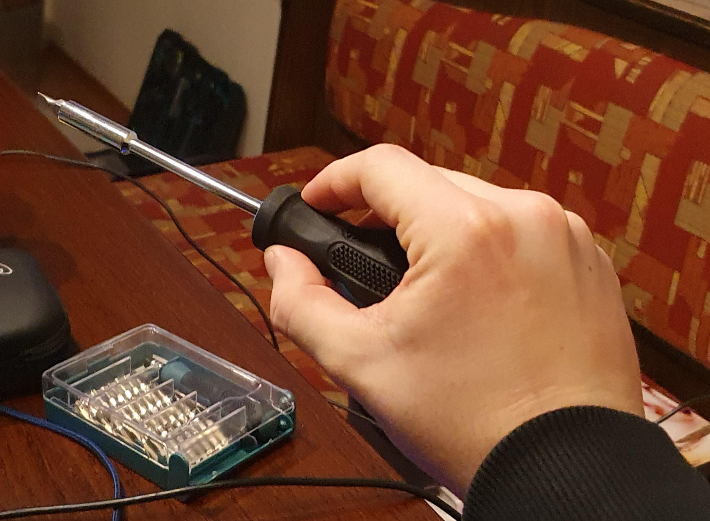

# Exercise PC Design & Development / Systems and Environments

## Assignment 3

**11908757 Stefan Haslhofer**

##### 1. Remarks

Each data sample is denoted by an operation (screw/unscrew) and a grip (grip1/grip2). To eliminate possible confusion I
appended pictures of each grip that I used:

* Grip 1:

  
* Grip 2:

  

Python code: https://github.com/StefanHaslhofer/PervasiveComputing/tree/main/Assignment3

##### 2. Data recording

To acquire data I taped my mobile phone to my wrist and screwed/unscrewed the same screw six times with each grip.

I recorded the acceleration of my wrist over time on my mobile phone with an app called _Physics Toolbox Sensor Suite_.
The app allows access to the phone's built-in linear accelerometer and displays acceleration on x, y and z axis as well
as a total acceleration value.

The data can be exported as _csv_. Each row contains a timestamp and all axis values plus the total acceleration.

##### 3. Pre-processing and Segmentation

Similar to assignment 2, I plotted the recordings in the time domain and in the frequency domain for a better
understanding of the data. In the previous assignment I concluded that all important frequencies in movements are quite
low. Hence, I also only consider low frequencies up to 50Hz for this assignment.  
Furthermore, I split the data recordings into windows of 5 seconds to get enough samples. I used a jumping window
approach. Windows do not overlap.

Above you can see two plots of one screw operation using grip 1:

1. x, y and z-axis acceleration plus as well as total acceleration over time
2. frequency composition of total acceleration

##### 4. Feature extraction

Next, I implemented a python script to extract the features and save it to an _arff_-file

First, I calculated mean and variance for the acceleration of my wrist along all axes as well as for the total
wrist acceleration. Looking at the result I noticed that the unscrew operation has a larger acceleration along the
z-axis and the screw operation has more acceleration along the x-axis. However, there is no clear difference in the
total acceleration of each operation (except some outliers) as can be seen in the two plots below:

Regarding the grips, there is a clear difference in acceleration for all axes including the total acceleration, which is
much higher for grip 1. Following plots visualize the acceleration of my wrist along all axes during the screwing
operation for both grips:

Unfortunately, the frequency domain seems not very helpful in this assignment. When comparing the graphs of total
acceleration signal frequencies for each operation combined with the grips we can hardly spot any difference except for
the screw operation using grip 1.
At least the amplitude seems to be moderately higher for the unscrew operation compared to the screw operation:

The following table lists all extracted features with some remarks:

| feature               | remark                                                                                       |
|-----------------------|----------------------------------------------------------------------------------------------|
| mean of x-axis        | mean acceleration of x-axis seems to be higher for the screw operation and grip 1            |
| mean of y-axis        | mean acceleration of y-axis is slightly lower for grip 2                                     |
| mean of z-axis        | mean acceleration of z-axis seems to be higher for the unscrew operation and grip 1          |
| mean of total Acc     | mean acceleration seems to be similar for both screwing and unscrewing but higher for grip 1 |
| var of x-axis         | variance of wrist acceleration seems to be lower for grip 2                                  |
| var of y-axis         | (see var of x-axis)                                                                          |
| var of z-axis         | (see var of x-axis)                                                                          |
| var of total Acc      | (see var of x-axis)                                                                          |
| max x-axis Acc        | the maximum acceleration seems to be lower for grip 1 but nearly the same for the operation  |
| max y-axis Acc        | (see var of x-axis)                                                                          |
| max z-axis Acc        | (see var of x-axis)                                                                          |
| max total Acc         | (see var of x-axis)                                                                          |
| max x freq energy     | maximal amplitude seems to be higher for the unscrew operation                               |
| max y freq energy     | (see max x freq energy)                                                                      |
| max z freq energy     | (see max x freq energy)                                                                      |
| max total freq energy | (see max x freq energy)                                                                      |
| sum of x-axis energy  | overall amplitude of frequencies seem to be higher for the unscrew operation                 |
| sum of y-axis energy  | (see sum of x-axis energy)                                                                   |
| sum of z-axis energy  | (see sum of x-axis energy)                                                                   |
| sum of total energy   | (see sum of x-axis energy)                                                                   |

##### 5. Operation classification

*Weka* was used for classifications.

I used the Weka visualization to filter out less significant features by hand. However, this proved to be an incorrect
approach as removing some features results in a slightly worse classification and is therefore unnecessary.

**a) J48**

Parameter tuning:

* C (confidenceFactor): Changing the parameter _C_ has no effect on the result.
* M (minNumObj): Changing the parameter _W_ only worsens the result.

**b) Naïve Bayes**

|               | TP Rate | FP Rate | Precision | Recall | F-Measure | MCC   | ROC Area | PRC Area | Class        |
|---------------|---------|---------|-----------|--------|-----------|-------|----------|----------|--------------|
|               | 1,000   | 0,020   | 0,944     | 1,000  | 0,971     | 0,962 | 1,000    | 1,000    | left_hand    |
|               | 0,941   | 0,000   | 1,000     | 0,941  | 0,970     | 0,961 | 1,000    | 1,000    | right_hand   |
|               | 0,912   | 0,010   | 0,969     | 0,912  | 0,939     | 0,921 | 0,960    | 0,934    | left_pocket  |
|               | 0,971   | 0,029   | 0,917     | 0,971  | 0,943     | 0,924 | 0,958    | 0,901    | right_pocket |
| Weighted Avg. | 0,956   | 0,015   | 0,957     | 0,956  | 0,956     | 0,942 | 0,979    | 0,959    |              |

Naive bayes has no parameters in *Weka*.

**c) kNN **

|               | TP Rate | FP Rate | Precision | Recall | F-Measure | MCC   | ROC Area | PRC Area | Class        |
|---------------|---------|---------|-----------|--------|-----------|-------|----------|----------|--------------|
|               | 1,000   | 0,029   | 0,919     | 1,000  | 0,958     | 0,944 | 0,996    | 0,978    | left_hand    |
|               | 0,941   | 0,010   | 0,970     | 0,941  | 0,955     | 0,941 | 0,982    | 0,931    | right_hand   |
|               | 0,912   | 0,000   | 1,000     | 0,912  | 0,954     | 0,941 | 0,957    | 0,939    | left_pocket  |
|               | 0,971   | 0,020   | 0,943     | 0,971  | 0,957     | 0,942 | 0,984    | 0,946    | right_pocket |
| Weighted Avg. | 0,956   | 0,015   | 0,958     | 0,956  | 0,956     | 0,942 | 0,980    | 0,949    |              |

Parameter tuning:

* k: I experimented with the parameter _k_ (number of nearest neighbors) until I hit the sweat spot at 3. This allowed
  me to increase accuracy from 94.9% to 95.6%.
* W: Increasing _W_ was not effective. A lower number decreased accuracy drastically, however choosing a large value for
  _W_ (e.g. 300) happens to deliver nearly the same results with slightly worse ROC Area.

**d) Multilayer perceptron**

|               | TP Rate | FP Rate | Precision | Recall | F-Measure | MCC   | ROC Area | PRC Area | Class        |
|---------------|---------|---------|-----------|--------|-----------|-------|----------|----------|--------------|
|               | 0,971   | 0,010   | 0,971     | 0,971  | 0,971     | 0,961 | 0,999    | 0,996    | left_hand    |
|               | 0,971   | 0,010   | 0,971     | 0,971  | 0,971     | 0,961 | 0,998    | 0,996    | right_hand   |
|               | 0,941   | 0,010   | 0,970     | 0,941  | 0,955     | 0,941 | 0,999    | 0,996    | left_pocket  |
|               | 0,971   | 0,020   | 0,943     | 0,971  | 0,957     | 0,942 | 0,969    | 0,974    | right_pocket |
| Weighted Avg. | 0,963   | 0,012   | 0,963     | 0,963  | 0,963     | 0,951 | 0,991    | 0,991    |              |

Parameter tuning:

- L (learningRate): A small decrease of the parameter _L_ leads to a slight increase in ROC Area (+0.1%) and PRC Area (
  +0.1%).
- M (momentum): Increasing the _momentum_ effects the result negatively. However, a slight decrease leads to a better
  ROC- (+0.1) and PRC Area (+0.2%). Nonetheless, the accuracy stays the same.
- N (trainingTime): Changing the parameter _N_ has no effect on the result.
- V (validationSetSize): Setting _V_ = 10 increases the TP rate by 1.4% and the ROC Area by 0.1%. Additionally, it
  decreases the FP Rate by 0.5%.
- S (seed): I increased the _S_ which at first did not change the outcome, however I found that for the randomly entered
  value _1111_ the ROC Area got increased by 0.1%. I could not find a better input.
- E (validationThreshold): Changing the parameter _E_ has no effect on the result.

Generally speaking, the standard parameters seem to perform good enough on the dataset.

**Summary**

In summary, the multilayer perceptron performed best with an accuracy of 96.3%. It also achieved the lowest FP rate at
0.12%. It is also worth mentioning that kNN and the naive bayes deliver nearly indistinguishable results. Because the
dataset is balanced the ROC Area is also a suitable metric. But even in this category the multilayer perceptron comes
out on top.

##### 6. Grip classification

*Weka* was used for classifications.

I used the Weka visualization to filter out less significant features by hand. However, this proved to be an incorrect
approach as removing some features results in a slightly worse classification and is therefore unnecessary.